# Configuração do plugin Dynamics
## Criação do usuário no Dynamics

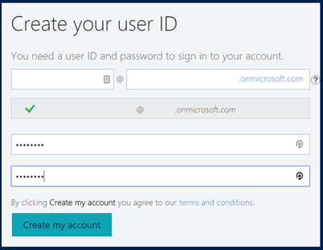

#### Salvar o User ID '.onmicrosoft.com'

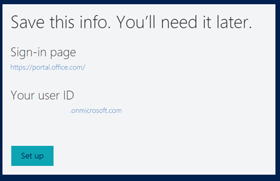

# Azure
## Entre no Azure Active Directory

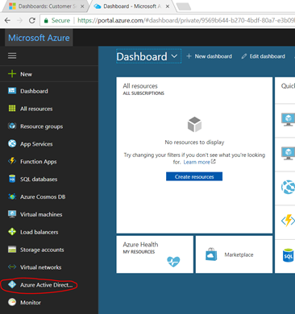

## Crie um novo App

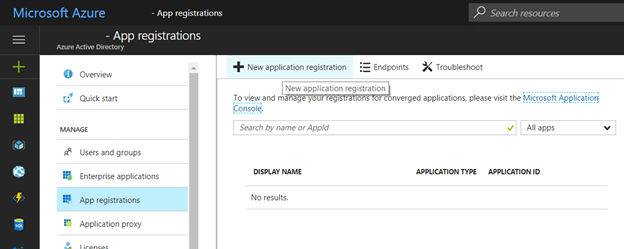

## Insira os dados do CRM e em seguida confirme

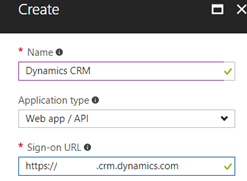

## Entre no App recém criado

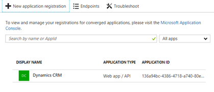

##  Copie o Application ID

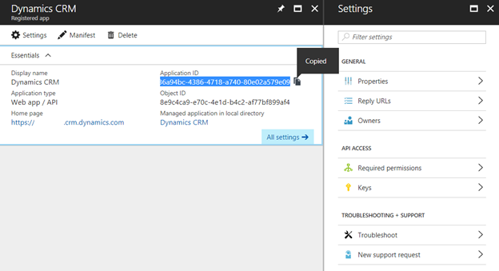

## Adicione uma nova Key e copie o Valor

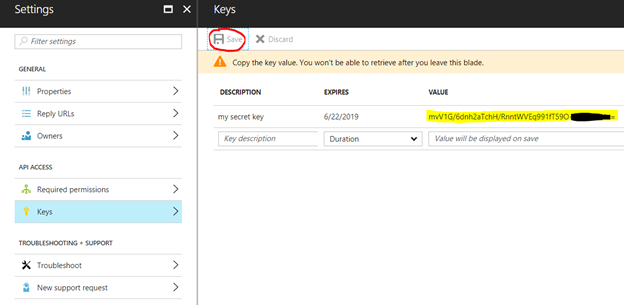

## Insira as URLs que foram fornecidas

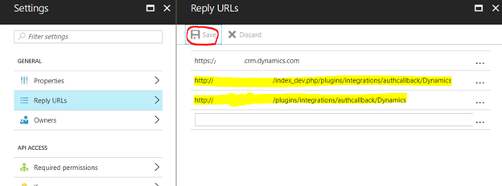

## Configure e adicione as permissões necessárias

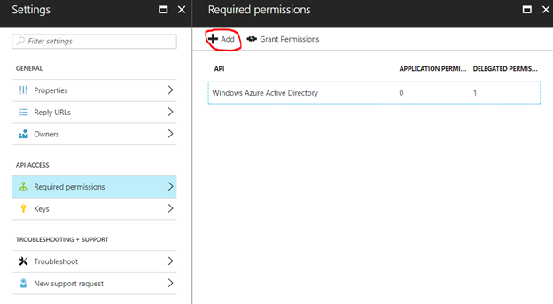

## Dê acesso a API do Dynamics

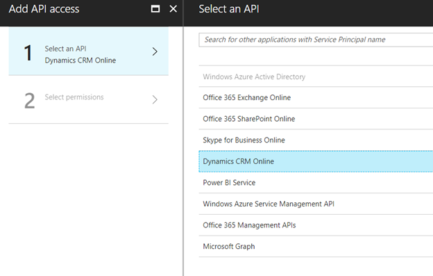

## Conceda acesso a organização

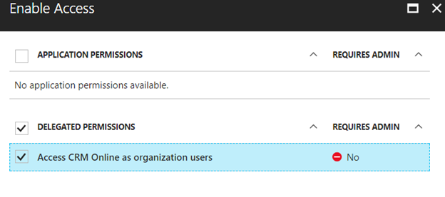

## Confirme as permissões

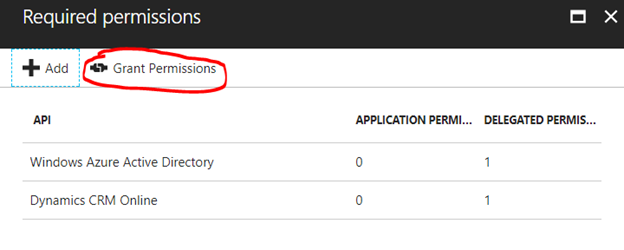